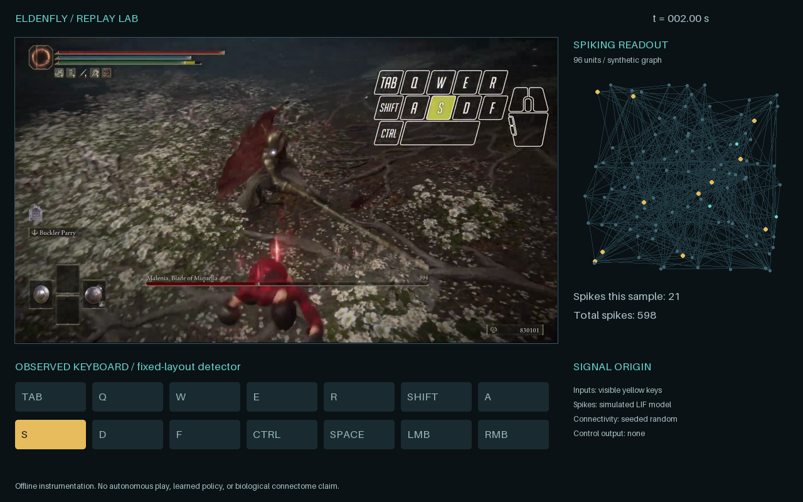
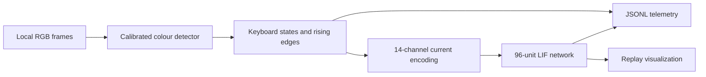

# Eldenfly

[](https://github.com/bubblik525/elden_ring/actions/workflows/tests.yml)

**A replay-driven experiment connecting visible keyboard input to a small spiking neural model.** Local video becomes timestamped button states, press events and a reproducible neural-activity visualization.

The structure is inspired by [Stonkfly](https://github.com/nftechie/stonkfly): separate sensory input, neural state and output layers, with explicit evidence boundaries. This implementation uses its own small synthetic graph. It does not contain Stonkfly code, a biological fly connectome, an autonomous Elden Ring player, or a trained combat policy.

## Run the demo

Python 3.11 or newer. No game installation, dataset, API keys, or GPU required.

```sh
python -m venv .venv
source .venv/bin/activate
pip install -e '.[test]'
python -m eldenfly demo --output runs/demo
```

This generates a calibration scene, a **silent** `replay.mp4`, `preview.png`, and `telemetry.jsonl`. The demo is synthetic, not gameplay footage ([demo preview](assets/demo.png)). The header image is a local Malenia recording processed by the same renderer.

## Use a recording

```sh
python -m eldenfly analyze /path/to/gameplay.mp4 --seconds 60 --output runs/session
python -m eldenfly render /path/to/gameplay.mp4 --seconds 60 --output runs/render
```

The built-in overlay profile is calibrated for the yellow-highlight keyboard used in the Malenia recordings: a 1920×1080 reference image, with the keyboard in the upper-right corner. Uniformly resized recordings work too. Other keyboard layouts, crops, highlight colours, or recordings without an input overlay need a new profile. Ordinary game HUD prompts do not reveal actual button presses.

`analyze` writes JSONL without rendering. `render` adds the visualization panel and creates a silent MP4; it does not preserve the input audio. Input recordings are read locally and excluded from Git.

## Data path



- **Measured:** yellow-pixel fractions, visible key states, sampling timestamps.
- **Computed:** press events and spikes from the documented LIF equations.
- **Illustrated:** synthetic connectivity and the neural panel's spatial layout.

The network's weights are fixed. There is no reinforcement learning, game input injection, live object recognition, boss detection, or evidence that a fly brain can play Elden Ring. [Model details](docs/model.md) · [Overlay calibration](docs/calibration.md) · [Validation](docs/validation.md).

## Tests

```sh
python -m pytest -q
```

Tests cover highlight detection at multiple resolutions, the shield icon obscuring F, false-positive colours, held-key event handling, neural time accumulation, refractory bounds, deterministic integration, CLI failures and a decoded demo export. GitHub Actions runs the suite on Python 3.11–3.13.

## Project layout

```text
eldenfly/inputs.py   calibrated highlight detector and press events
eldenfly/neural.py   deterministic integrate-and-fire model
eldenfly/render.py   Pillow instrumentation panel
eldenfly/cli.py      demo, analyze and render commands
assets/             reproducible README preview
```

MIT-licensed code. The project is independent of FromSoftware and Bandai Namco. Game footage and biological datasets are not distributed in this repository.
