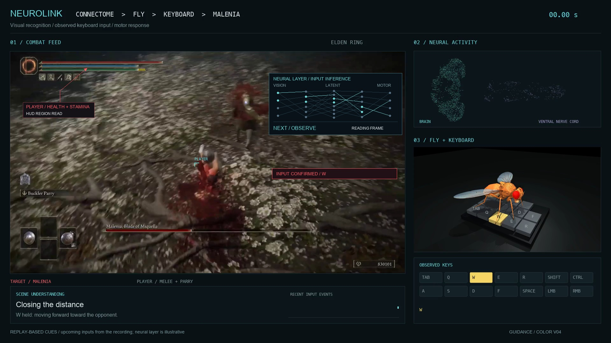
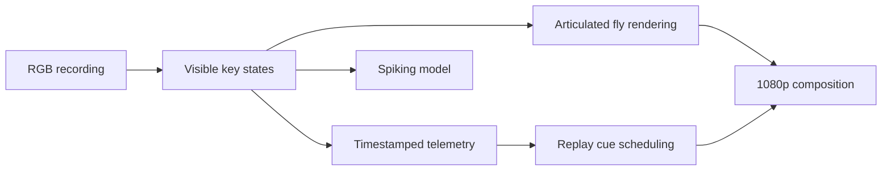

# Eldenfly

[](https://github.com/bubblik525/elden_ring/actions/workflows/tests.yml)

**Replay instrumentation for Elden Ring: keyboard telemetry, spiking activity, articulated fly rendering and frame-aligned combat cues.**



The production scripts in this repository are portable adaptations of the code used to render the Malenia sequence. Feed a local recording through the pipeline to export a color gameplay composition, an animated flybody model, neural panels and timestamped input data.

## Quick start

Python 3.11 or newer:

```sh
python -m venv .venv
source .venv/bin/activate
pip install -e '.[test]'
python -m eldenfly demo --output runs/demo
python -m pytest -q
```

The self-contained calibration demo exports `replay.mp4`, `preview.png` and `telemetry.jsonl`. It requires no game installation or external assets.

## Process a recording

```sh
python -m eldenfly analyze gameplay.mp4 --seconds 60 --output runs/session
python -m eldenfly render gameplay.mp4 --seconds 60 --output runs/render
```

The keyboard detector reads the yellow input overlay in the Malenia recording profile. It supports uniform resizing; a different layout needs [calibration](docs/calibration.md). The lightweight renderer exports silent video and drives a deterministic 96-unit integrate-and-fire network from observed button states.

## Production render

Install FFmpeg and the optional renderer dependencies:

```sh
pip install -e '.[cinema,test]'
git clone https://github.com/TuragaLab/flybody.git vendor/flybody
git -C vendor/flybody checkout d015e9bfe441bd90ae431bac24c55cb74bdbce26

python scripts/malenia_scene.py \
  --input malenia.mp4 \
  --brain brain-reference.png \
  --fly-assets vendor/flybody/flybody/fruitfly/assets \
  --output runs/scene --seconds 60

python scripts/malenia_guidance.py \
  --input runs/scene/Malenia-Fly-Keyboard-Sync.mp4 \
  --telemetry runs/scene/observed-inputs.json \
  --output runs/guidance --seconds 60
```

This exports 1920×1080 video at 24 fps with source audio when available. Use `--seconds 2` in both commands for a smoke render. The production composition is calibrated to the original Malenia clip and the supplied brain projection; see [assets, timing and setup](docs/production.md).

## Pipeline



The lightweight neural model and production visual layers are separate components. Recorded inputs drive the fly animation; combat markers and next-action cues are replay annotations. [Implementation and evidence](docs/production.md#implementation-boundaries) explains how each layer is generated.

## Repository

| Component | Purpose |
| --- | --- |
| `eldenfly/inputs.py` | Keyboard sampling and rising-edge events |
| `eldenfly/neural.py` | Fixed-weight LIF integration |
| `eldenfly/render.py` | Lightweight telemetry compositor |
| `eldenfly/production.py` | Production arguments, assets and timing validation |
| `scripts/malenia_scene.py` | MuJoCo flybody and color composition |
| `scripts/malenia_guidance.py` | Neural cover, arrows and input countdowns |
| `tests/` | Detection, integration, export and validation tests |

[Model](docs/model.md) · [Validation](docs/validation.md) · [Third-party materials](THIRD_PARTY.md)

MIT-licensed code. Independent of FromSoftware and Bandai Namco. Gameplay recordings and external anatomical assets are supplied locally.
