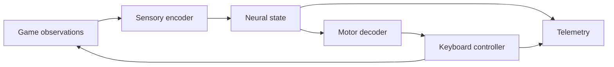

# FlyBrain / Elden Ring

[](https://github.com/bubblik525/elden_ring/actions/workflows/tests.yml)

**A fly-inspired neural control project for Elden Ring.**

The goal is a closed loop: game observations become sensory inputs, a neural model produces motor signals, and a controller translates those signals into game actions. Each action changes the next observation.

**Status:** controller integration is planned. The current release provides a small spiking model, recorded-input telemetry and fly animation tools. Autonomous gameplay has not been demonstrated.


*Current instrumentation preview; controller architecture below is the development target.*

## How it will work

1. **Observe** the game through a live frame adapter.
2. **Encode** visual features into sensory currents.
3. **Integrate** neural activity across successive observations.
4. **Decode** motor activity into movement, dodge, attack and interaction commands.
5. **Execute** bounded key presses and feed the next observation back into the model.



This is the target architecture. The existing 96-unit fixed-weight LIF network is a starting component, not a biological fly connectome. The live encoder, motor decoder and keyboard controller remain to be implemented.

## Run it

Python 3.11 or newer. From the repository root:

```sh
python -m venv .venv
source .venv/bin/activate
pip install -e '.[test]'
python -m eldenfly demo --output runs/demo
python -m pytest -q
```

These commands run the existing calibration demo and tests. Outputs include `replay.mp4`, `preview.png` and `telemetry.jsonl`. The package name remains `eldenfly`. A live game-control command will be documented when the controller is available.

## Controller integration plan

| Component | Responsibility | Status |
| --- | --- | --- |
| Neural core | Integrate input currents and emit spikes | Available: 96-unit LIF model |
| Telemetry | Record observed inputs and neural activity | Available for recorded inputs |
| Live observation adapter | Capture timestamped game frames | Planned |
| Sensory encoder | Convert scene features into neural inputs | Planned |
| Motor decoder | Map neural outputs to game actions | Planned |
| Keyboard controller | Execute, limit and release key presses | Planned |
| Closed-loop evaluation | Measure outcomes across repeatable encounters | Planned |

The next milestone is one reproducible observation-to-action cycle with timestamped logs and key release on stop. Encounter evaluation follows controller integration.

## Development

```text
eldenfly/inputs.py       input sampling and press events
eldenfly/neural.py       spiking neural core
eldenfly/cli.py          existing demo and telemetry commands
eldenfly/render.py       instrumentation panel
eldenfly/production.py   production argument and asset validation
scripts/                Malenia composition pipeline
tests/                 detection, integration and export checks
```

See [model details](docs/model.md), [calibration](docs/calibration.md), [production tooling](docs/production.md) and [validation](docs/validation.md) for the current implementation. Existing rendering commands are in [the rendering guide](docs/rendering.md).

## Acknowledgments

[Stonkfly](https://github.com/nftechie/stonkfly) inspired the separation of sensory input, neural state and action execution. Fly rendering uses externally supplied [flybody](https://github.com/TuragaLab/flybody) assets. Neither project's source or connectome data is bundled here.

MIT-licensed code. See [third-party materials](THIRD_PARTY.md) for asset details. Independent of FromSoftware and Bandai Namco.
